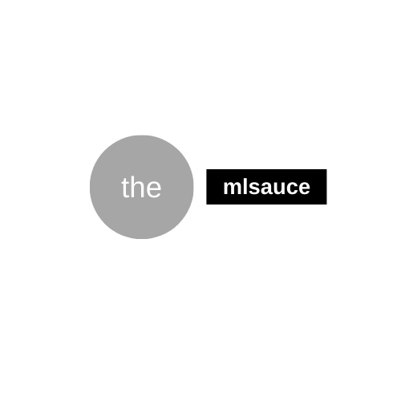

mlsauce
--------



<hr>

Miscellaneous Statistical/Machine learning stuff.  

 [](https://github.com/Techtonique/mlsauce/blob/master/LICENSE) [](https://pepy.tech/project/mlsauce) [](https://anaconda.org/conda-forge/mlsauce)   [](http://hits.dwyl.com/Techtonique/mlsauce)
[](https://www.codefactor.io/repository/github/techtonique/mlsauce)
[](https://techtonique.github.io/mlsauce/)


## Contents 
 [Installation for Python and R](#installation-for-Python-and-R) |
 [Package description](#package-description) |
 [Quick start](#quick-start) |
 [Contributing](#Contributing) |
 [Tests](#Tests) |
 [Dependencies](#dependencies) |
 [Citing `mlsauce`](#Citation) |
 [API Documentation](#api-documentation) |
 [References](#References) |
 [License](#License) 


## Installation (for Python and R)

### Python 

- _1st method_

```bash
pip install mlsauce --verbose
```

- __2nd method__: from Github, for the development version

```bash
pip install git+https://github.com/Techtonique/mlsauce.git --verbose
```

- __3r method__: using `conda`

```bash
conda install -c conda-forge mlsauce 
```

(Note to self or developers: https://github.com/conda-forge/mlsauce-feedstock and https://conda-forge.org/docs/maintainer/adding_pkgs.html#step-by-step-instructions)

### R 

Only for Linux, for now. Windows users can envisage using [WSL](https://docs.microsoft.com/en-us/windows/wsl/install-win10), the **Windows Subsystem for Linux**.

**From GitHub**

```bash
remotes::install_github("Techtonique/mlsauce_r") # the repo is in this organization
```

**From R-universe**

```bash
install.packages('mlsauce', repos = c('https://techtonique.r-universe.dev',
'https://cloud.r-project.org'))
```

__General rule for using the package in R__:  object accesses with `.`'s are replaced by `$`'s. R Examples can be found in the package, once installed, by typing (in R console):

```R
?mlsauce::AdaOpt
```

For a list of available models, visit [https://techtonique.github.io/mlsauce/](https://techtonique.github.io/mlsauce/).

### Docker

```
make docker-build ## Build Docker image for mlsauce
make docker-run-examples  # test thoroughly
make docker-pypi-release  # Run an interactive shell inside the mlsauce Docker container
```

## Package description

Miscellaneous Statistical/Machine learning stuff. See next section. 

## Quick start

Examples can be found [here on GitHub](https://github.com/Techtonique/mlsauce/tree/master/examples). You can also read about this package [here](https://thierrymoudiki.github.io/blog/), and in particular for `LSBoost`: [https://thierrymoudiki.github.io/blog/#LSBoost](https://thierrymoudiki.github.io/blog/#LSBoost).

## Contributing

Your contributions are welcome, and valuable. Please, make sure to __read__ the [Code of Conduct](CONTRIBUTING.md) first. If you're not comfortable with Git/Version Control yet, please use [this form](https://forms.gle/tm7dxP1jSc75puAb9) to provide a feedback.

In Pull Requests, let's strive to use [`black`](https://black.readthedocs.io/en/stable/) for formatting files: 

```bash
pip install black
black --line-length=80 file_submitted_for_pr.py
```

A few things that we could explore are:

- Enrich the [tests](#Tests)
- Continue to make `mlsauce` available to `R` users --> [here](./R-package)
- Any benchmarking of `mlsauce` models can be stored in [demo](/mlsauce/demo) (notebooks) or [examples](./examples) (flat files), with the following naming convention:  `yourgithubname_ddmmyy_shortdescriptionofdemo.[py|ipynb|R|Rmd]`


## Tests

**Ultimately**, tests for `mlsauce`'s features **will** be located [here](mlsauce/tests). In order to run them and obtain tests' coverage (using [`nose2`](https://nose2.readthedocs.io/en/latest/)), you'll do: 

- Install packages required for testing: 

```bash
pip install nose2
pip install coverage
```

- Run tests and print coverage:

```bash
git clone https://github.com/thierrymoudiki/mlsauce.git
cd mlsauce
nose2 --with-coverage
```

- Obtain coverage reports:

At the command line:

```bash
coverage report -m
```

  or an html report:

```bash
coverage html
```

Note to self and developpers: [https://conda-forge.org/docs/maintainer/adding_pkgs.html#step-by-step-instructions](https://conda-forge.org/docs/maintainer/adding_pkgs.html#step-by-step-instructions)

## API Documentation

- https://techtonique.github.io/mlsauce/

## Dependencies 

- Numpy
- Scipy
- scikit-learn
- querier

## Citation

```
@misc{moudiki2019mlsauce,
author={Moudiki, Thierry},
title={\code{mlsauce}, {M}iscellaneous {S}tatistical/{M}achine {L}earning stuff},
howpublished={\url{https://github.com/thierrymoudiki/mlsauce}},
note={BSD 3-Clause Clear License. Version 0.x.x.},
year={2019--2020}
}
```

## References

- Moudiki, T. (2020). LSBoost, gradient boosted penalized nonlinear least squares.
    Available at: 
  https://www.researchgate.net/publication/346059361_LSBoost_gradient_boosted_penalized_nonlinear_least_squares

- Moudiki, T. (2020). AdaOpt: Multivariable optimization for classification. 
    Available at: 
    https://www.researchgate.net/publication/341409169_AdaOpt_Multivariable_optimization_for_classification

## License

[BSD 3-Clause](LICENSE) © Thierry Moudiki, 2019. 


## Credits

This package was created with [Cookiecutter](https://github.com/cookiecutter/cookiecutter)  and the [project template](https://github.com/audreyr/cookiecutter-pypackage).

